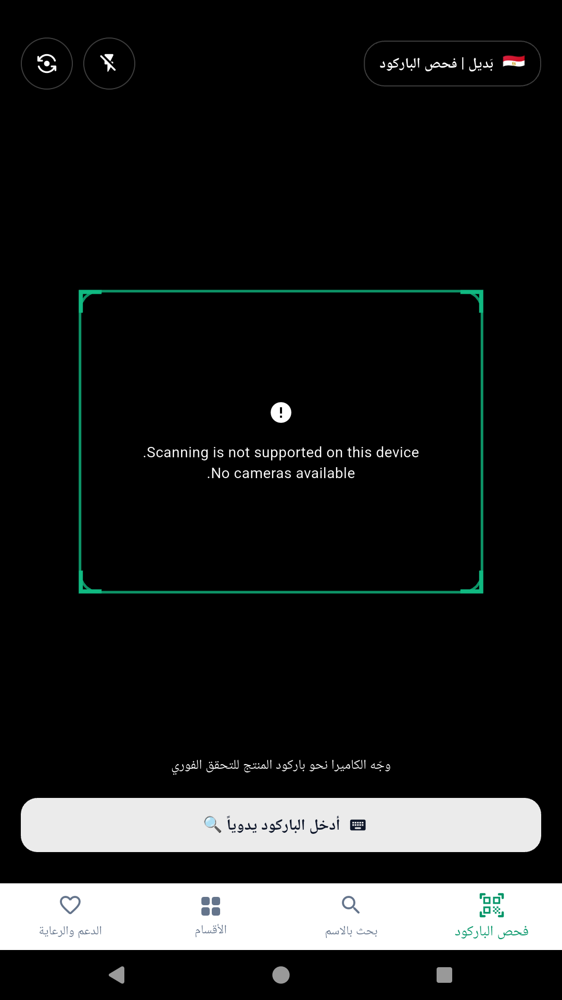
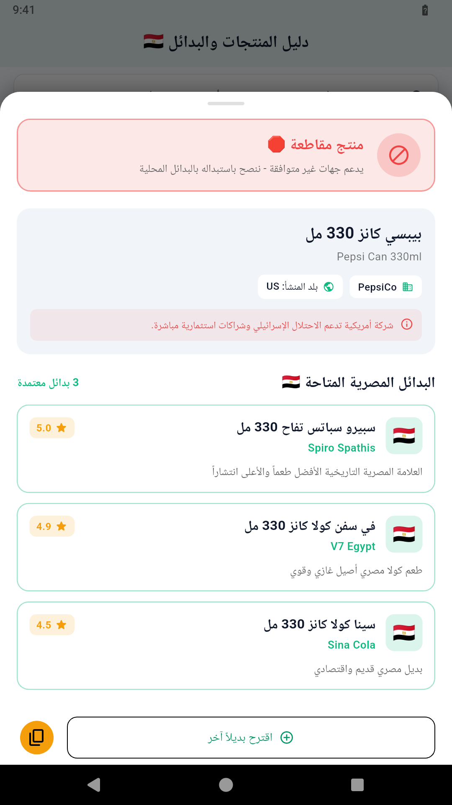
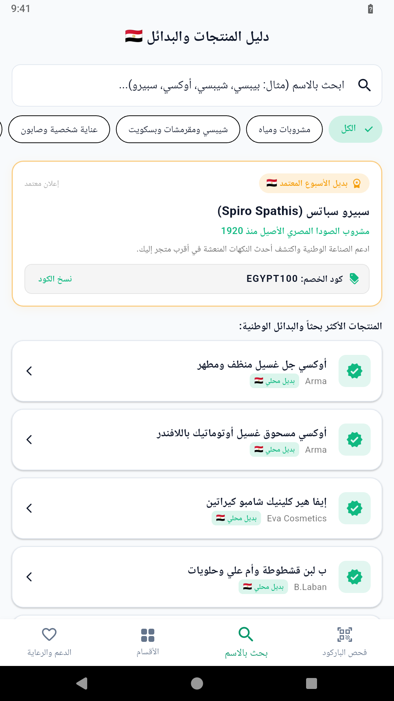
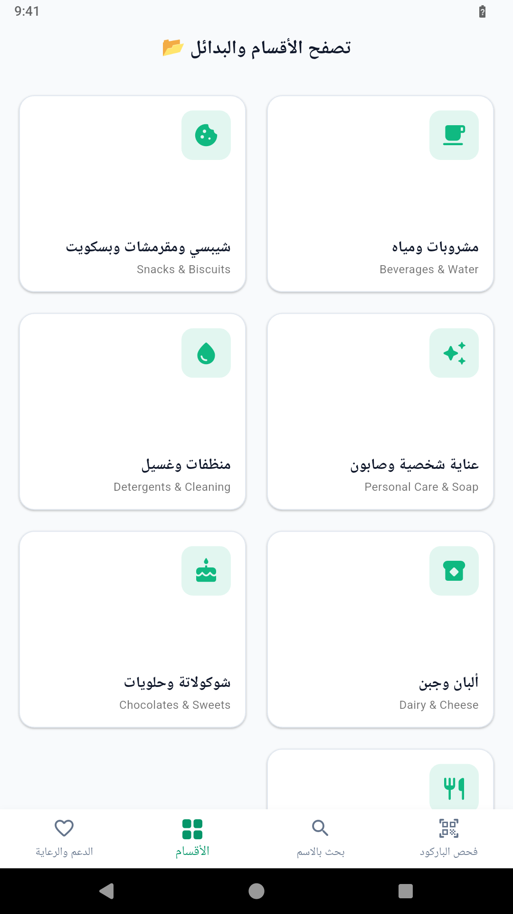
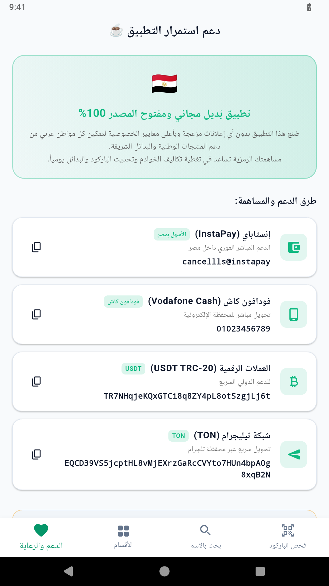

<p align="center">
  
  
  
  
  
  
</p>

<h1 align="center">Badil (بَديل) 🇪🇬</h1>
<p align="center"><strong>فحص مقاطعة المنتجات واكتشاف البدائل المصرية والعربية 100% بدون إنترنت</strong></p>
<p align="center">
  <em>Instant Offline Barcode Scanner · Verified Boycott Database · 100% Egyptian Alternatives · FTS5 Arabic Search</em>
</p>
<p align="center">
  <a href="https://github.com/Cancellls/Badil/releases/latest">تحميل أحدث إصدار (Download APK)</a>
</p>

---

## 🌟 لماذا بَديل؟ (Why Badil?)

في ظل رغبة الملايين في دعم الاقتصاد الوطني والمنتجات الشريفة، تواجه التطبيقات الحالية عدة مشاكل:
1. **بطء وتوقف مستمر** داخل طوابق السوبرماركت السفلية التي تنعدم فيها شبكة المحمول.
2. **إعلانات مزعجة وتتبع لبيانات المستخدم**.
3. **الاكتفاء بذكر المقاطعة فقط دون توفير بدائل حقيقية ومجربة**.

**بَديل (Badil)** صُمم ليكون مختلفاً تماماً:
* **100% Offline-First:** كل البيانات وقاعدة المنتجات مدمجة داخل التطبيق (`badil_seed.db`) وتعمل بدون إنترنت نهائياً في أقل من 10 ملي ثانية.
* **البديل أولاً (Badeel-First):** عند فحص أي منتج مقاطعة، يبرز التطبيق فوراً 2 إلى 4 بدائل مصرية موثوقة مع تقييم الجودة وقصة كل علامة وطنية.
* **محرك بحث عربي فائق السرعة (FTS5):** دعم كامل للبحث اللحظي مع معالجة التشكيل واختلافات الهمزات (`أ/إ/آ -> ا`, `ة -> ه`, `ى -> ي`).
* **خصوصية تامة ومعايير F-Droid الحرة:** خالٍ من أي حزم تتبع أو إعلانات تجسسية أو مكتبات Google المغلقة.

---

## 📸 لقطات من التطبيق (Screenshots)

<p align="center">
  
  
  
</p>

<p align="center">
  
  
</p>

---

## 🚀 المميزات الرئيسية (Features)

### 1. ماسح الباركود الفوري (Instant Barcode Scanner)
- محرك مسح مفتوح المصدر بالكامل مبني على **CameraX / ZXing** المتوافق بنسبة 100% مع معايير F-Droid بدون أي مكتبات احتكارية من Google Play Services.
- دعم شامل لباركود السلع الغذائية (EAN-13, EAN-8, UPC-A).
- زر إضاءة (Torch) للممرات المظلمة بالسوبرماركت، مع زر بديل لإدخال الباركود يدوياً عند تلف الملصق.
- اهتزاز هابتي (Haptic Feedback) فوري عند التعرف على الباركود.

### 2. بطاقة النتيجة والبدائل الوطنية (Product & Alternatives Card)
- 🛑 **منتج مقاطعة:** إبراز اسم الشركة الأم، سبب وتوثيق المقاطعة، وقائمة بالبدائل المصرية المقترحة.
- 🟢 **منتج محلي 100%:** احتفاء بالصناعة الوطنية مع بطاقة شكر لتشجيع شراء المنتج المحلي.
- ❓ **منتج غير مسجل:** نموذج سريع من شاشة واحدة لاقتراح اسم المنتج وبديله لحفظه ومزامنته لاحقاً.
- مشاركة فورية للبدائل بنقرة واحدة عبر واتساب ووسائل التواصل.

### 3. دليل الأقسام والبحث بالاسم (Search & Categories)
- بحث نصي فوري مدعوم بـ **SQLite FTS5**.
- 7 أقسام رئيسية:
  * ☕ **مشروبات ومياه** (سبيرو سباتس، في سفن، داش، سيوة، فلو، شاي العروسة، مصر كافيه...)
  * 🍪 **شيبسي ومقرمشات وبسكويت** (تايجر، بيج شيبس، فوكس، كرانش، بيك رولز...)
  * 🍫 **شوكولاتة وحلويات** (كورونا المصرية، بيمبو، فريسكا، لمبادا...)
  * 🧼 **منظفات وغسيل** (أوكسي، فيبا، بحر، فريسك...)
  * ✨ **عناية شخصية وصابون** (إيفا، بوبانا، بندولين، ستارفيل، خمس خمسات...)
  * 🧀 **ألبان وجبن** (لمار، جهينة، دومتي، قتيلو، عبور لاند...)
  * 🍽️ **مطاعم وكافيهات** (بافلو برجر، بازوكا، ب لبن، المالكي...)

### 4. رعاية البدائل وصندوق الدعم (Sponsorship & Tip Jar)
- **بديل الأسبوع المعتمد:** مساحة مخصصة لإبراز المنتجات المصرية الصاعدة مع أكواد خصم حصرية لتشجيع المستهلكين.
- **طرق الدعم:** دعم استمرار الخوادم وتطوير قاعدة البيانات عبر إنستاباي (InstaPay)، فودافون كاش، وعملات رقمية (USDT / TON).

---

## 🏗️ البنية البرمجية (Architecture)

```
Badil/
├── assets/
│   └── database/
│       └── badil_seed.db            # SQLite database pre-seeded with 90+ staples & 53 alternatives
│
├── lib/
│   ├── main.dart                    # App bootstrap & orientation lock
│   ├── core/
│   │   ├── database/
│   │   │   └── database_helper.dart # SQLite FTS5, normalization & WAL engine
│   │   └── theme/
│   │       └── app_theme.dart       # Material 3 emerald green & gold RTL theme
│   ├── data/
│   │   ├── models/                  # Category, Product, Alternative, Submission, Sponsor
│   │   └── repositories/            # ProductRepository, CrowdsourceRepository, SponsorRepository
│   └── presentation/
│       ├── root_nav.dart            # 4-tab Bottom Navigation Controller
│       ├── scanner/                 # MobileScanner camera view & manual barcode dialog
│       ├── search/                  # Instant FTS5 search & category chips
│       ├── categories/              # Grid of departments & category details
│       ├── result/                  # Boycott / Alternative bottom sheet & suggestion form
│       └── tip_jar/                 # InstaPay & community contribution screen
│
├── backend/                         # Cloudflare Worker API & D1 Backend
│   ├── src/index.ts                 # Hono API: submissions, delta sync, web admin panel
│   ├── wrangler.jsonc               # Cloudflare configuration & D1 database binding
│   └── schema.sql                   # Serverless D1 table schemas
│
├── metadata/                        # F-Droid submission manifest
│   └── com.cancellls.badil.yml
└── tool/
    └── seed_generator.py            # Python compiler for SQLite FTS5 seed database
```

---

## 🛠️ البناء والتشغيل (Build & Development)

### متطلبات التشغيل:
- Flutter SDK `^3.10` أو أحدث.
- Python 3.10+ (لتوليد قاعدة البيانات الأولية).
- Android SDK 35 (Java 17).

### خطوات التشغيل:
```bash
# 1. استنساخ المستودع
git clone https://github.com/Cancellls/Badil.git
cd Badil

# 2. تثبيت الحزم
flutter pub get

# 3. توليد وتحديث قاعدة البيانات المدمجة
python3 tool/seed_generator.py

# 4. تشغيل الاختبارات
flutter test

# 5. بناء تطبيق أندرويد
flutter build apk --debug --target-platform=android-arm64
```

---

## ☁️ خادم المزامنة (Cloudflare Worker Backend)

يتضمن المشروع خادماً خفيفاً بدون خوادم (Serverless) في مجلد `backend/` لتلقي اقتراحات المستخدمين وإدارة رعايات البدائل:
```bash
cd backend
npm install
npm run dev      # تشغيل محلي عبر Wrangler
npm run deploy   # نشر مباشر على شبكة Cloudflare العالمية
```
- **لوحة الإدارة:** مدمجة في مسار `/admin?key=YOUR_PASSWORD` لمراجعة المنتجات واعتمادها بنقرة واحدة.

---

## 📜 الترخيص والمصادر الحرة (License)

تطبيق **بَديل** مرخص بموجب رخصة **GNU General Public License v3.0 (GPL-3.0)** لضمان بقائه حراً ومفتوح المصدر وخالياً من أي احتكار للأبد.

صُنع بكل فخر لدعم الاقتصاد الوطني 🇪🇬.
